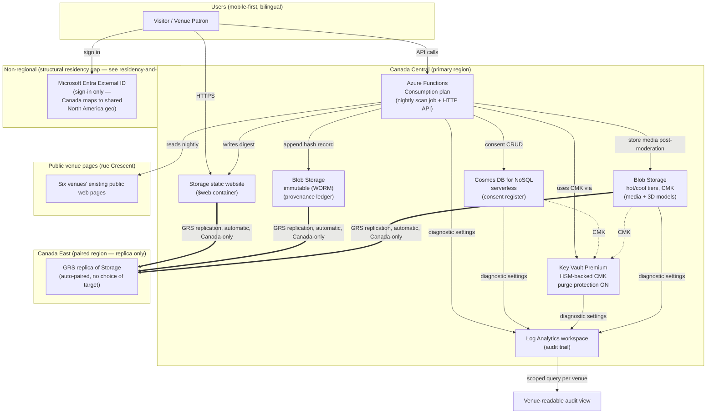

# The Crescent Street Twin — Azure Reference Architecture

Status: **design only, nothing deployed.** See `README.md` for scope and `decisions.md` for the reasoning behind each choice below. All facts in this document were checked against [Microsoft Learn](https://learn.microsoft.com/) and the official Azure pricing pages on 2026-08-07/08; where the live pricing page renders numbers client-side and could not be read as text, a secondary source is cited alongside and flagged. See `cost-model.md` for the numbers and `residency-and-keys.md` for the residency/key details this file only summarizes.

## 0. Scale assumption

Six venues, one street, low thousands of monthly users. Every SKU choice below is picked for this scale first; a "cheaper rejected alternative" and a "what changes at 60 venues" note is given per component. This is deliberately not a design that assumes future growth — see `decisions.md` ADR-1.

## 1. Component-by-component architecture

### 1.1 Static bilingual mobile-first web surface

- **Service/SKU: Azure Storage static website hosting** (`$web` container) on a **StorageV2 (general-purpose v2), Standard, LRS or GRS** account in **Canada Central**, fronted optionally by a custom domain + free-tier TLS.
- **Why:** Enabling the static website feature on a Storage account costs nothing beyond blob storage, transactions, and egress — [Microsoft Learn: Static website hosting in Azure Storage](https://learn.microsoft.com/en-us/azure/storage/blobs/storage-blob-static-website). The account, and therefore every byte of the site, is pinned to a single Azure region you choose explicitly at creation time.
- **Cost at scale:** A few hundred MB of HTML/CSS/JS/3D-viewer assets plus low-thousands of monthly visitors is a few dollars a month in storage + transactions + egress (see `cost-model.md`).
- **Cheaper/rejected alternative — Azure Static Web Apps:** Static Web Apps' Free/Standard tiers look attractive (Standard ≈ $9/app/month, [TrustRadius: Azure Static Web Apps Pricing](https://www.trustradius.com/products/azure-static-web-apps/pricing); official page: [Azure Static Web Apps pricing](https://azure.microsoft.com/en-us/pricing/details/app-service/static/)), but its managed Functions/API backend and staging environments are **only available in Central US, East US 2, East Asia, West Europe, and West US 2** — no Canadian region exists for that backend today, confirmed twice: [GitHub Azure/static-web-apps issue #443](https://github.com/Azure/static-web-apps/issues/443) (a Microsoft maintainer states plainly "it is a global service and there are no data residency guarantees") and [Microsoft Q&A: ETA for availability of Static Web Apps in Canada region](https://learn.microsoft.com/en-us/answers/questions/529405/eta-for-availabilty-of-static-web-apps-in-canada-r) ("currently not supported... no ETA"). Rejected on residency grounds, not cost.
- **CDN/Front Door note:** Azure Front Door/CDN would improve latency for the static assets but is architecturally a global anycast service "not tied to any specific Azure region" and is one of the services explicitly excluded from the EU's own data-boundary guarantee for the same structural reason — [Microsoft Learn: Services excluded from the EU Data Boundary](https://learn.microsoft.com/en-us/privacy/eudb/eu-data-boundary-excluded-services); general caveat also at [Azure Data Residency](https://azure.microsoft.com/en-us/explore/global-infrastructure/data-residency). At six-venue, low-thousands-of-users scale there is no latency problem to solve, so it is not used at all — not even for the public, non-personal static assets — to keep the "no US replication" story simple and auditable. This is revisited in `decisions.md` ADR-6.

### 1.2 Nightly scan job (reads venues' public pages, writes a JSON digest)

- **Service/SKU: Azure Functions, Consumption plan, timer trigger**, Canada Central.
- **Why:** A once-nightly job that reads six public web pages and writes one JSON file is seconds of compute per run. Consumption plan bills $0.000016/GB-s of execution plus $0.20 per million executions, with a permanent free monthly grant of 400,000 GB-s and 1,000,000 executions — [Azure Functions pricing](https://azure.microsoft.com/en-us/pricing/details/functions/) (rate figures cross-checked against [dev.to: Scaling Azure Functions](https://dev.to/martin_oehlert/scaling-azure-functions-consumption-vs-premium-vs-dedicated-2gm)). At 30 executions/month this job will not leave the free tier for years, at any of the three scales modeled in `cost-model.md`.
- **Cost at scale:** effectively $0/month (inside free grant) at 6, 20, and 60 venues.
- **Cheaper/rejected alternative — Container Apps Jobs:** Container Apps (Consumption plan, Jobs feature) is confirmed fully available in Canada Central, and its free grant (180,000 vCPU-s, 360,000 GiB-s, 2,000,000 requests/month) is also large enough to run this job for free — [Azure Container Apps pricing](https://azure.microsoft.com/en-us/pricing/details/container-apps/); region support table: [Azure Container Apps region availability](https://microsoft.github.io/azure-container-apps/aca-getting-started/region-availability.html). Functions is preferred here only because it needs zero container build/packaging step for a simple scheduled script — Container Apps Jobs is the documented fallback if the scan logic later needs a heavier runtime (headless browser, etc.) than the Functions Consumption sandbox comfortably allows.

### 1.3 API layer

- **Service/SKU: the same Azure Functions Consumption app, HTTP-triggered functions**, Canada Central — no separate API Management tier in front of it.
- **Why:** The API surface at this scale is small (register consent, revoke consent, read digest, read own audit log, upload photo/video, read presence count) and low volume (low thousands of users, not low thousands of requests per second). HTTP-triggered Functions bill under the same Consumption meter as the nightly job and share the same free grant — [Azure Functions pricing](https://azure.microsoft.com/en-us/pricing/details/functions/).
- **Cost at scale:** effectively $0–a few dollars/month at 6 and 20 venues; still comfortably inside or just past the free grant at 60 venues (see `cost-model.md`).
- **Cheaper/rejected alternative — Azure API Management, Consumption tier:** APIM Consumption gives you a real API gateway (policies, rate limiting, a developer portal) for $3.50 per million calls past the first 1,000,000 free per month — [Azure API Management pricing](https://azure.microsoft.com/en-us/pricing/details/api-management/), figures corroborated by [apigatewaycost.com: Azure API Management Pricing](https://apigatewaycost.com/azure). Rejected for now purely on complexity-for-scale grounds — six venues do not need a developer portal or gateway policies — but it is the documented upgrade path if the API needs to be exposed to third-party integrators later. **App Service (Linux, Basic B1)** was also considered as an always-on API host (~$13.14/month per [Microsoft Learn Q&A pricing example](https://learn.microsoft.com/en-us/answers/questions/5605657/web-app-database-on-linux), consistent with [Azure App Service for Linux pricing](https://azure.microsoft.com/en-us/pricing/details/app-service/linux/)) and rejected because it bills by the hour whether or not it is called, which is strictly worse than Consumption Functions at this traffic level.

### 1.4 Consent register (default-deny grants: one audience, one purpose, one surface, 12-month expiry, one-action revocation)

- **Service/SKU: Azure Cosmos DB for NoSQL, serverless capacity mode**, single-region account pinned to Canada Central.
- **Why:** Cosmos DB is listed by Microsoft as a **foundational service** — meaning it is recommended and expected to be present in every region category including Canada Central — [Microsoft Learn: Available services by region types and categories](https://docs.azure.cn/en-us/reliability/availability-service-by-category). Direct region tables for Cosmos DB's other APIs confirm Canada Central (and Canada East) explicitly: [Azure Cosmos DB for MongoDB (vCore) region availability](https://learn.microsoft.com/en-us/azure/cosmos-db/mongodb/vcore/regional-availability) and [Azure Cosmos DB for PostgreSQL regional availability](https://learn.microsoft.com/en-us/azure/cosmos-db/postgresql/resources-regions) (the latter explicitly geo-backs Canada Central to Canada East). Serverless mode fits the shape of this workload well: a small number of consent-grant documents, read/written occasionally, not a sustained high-throughput stream — you pay per request unit consumed with no minimum, rather than provisioning throughput you don't need — [Azure Cosmos DB pricing](https://azure.microsoft.com/en-ca/pricing/details/cosmos-db/serverless/) and [Microsoft Learn: Serverless (consumption-based) account type](https://learn.microsoft.com/en-us/azure/cosmos-db/serverless). Each grant document carries: audience, purpose, surface, granted-at, expires-at (default 12 months), and a revoked-at field the API layer can set in one write — enforcing "one-action revocation" as an application-level guarantee on top of the store.
- **Note:** the Cosmos DB free tier (1,000 RU/s + 25 GB) does **not** apply to serverless accounts, and a serverless account can only run in a single Azure region — both per the pricing page above. Single-region is not a problem here (Canada Central is the only region we want data written to anyway); it does mean Cosmos DB itself gives you no automatic cross-region replica — durability for this store rides on Cosmos DB's own SLA plus periodic export/backup (see §1.9).
- **Cost at scale:** low — see `cost-model.md`; consent records are small and infrequently written.
- **Cheaper/rejected alternative — Azure Table Storage:** Table Storage (part of the same Storage account used for §1.1/§1.6) would be materially cheaper and is also a foundational, Canada-Central-available service. It is documented as the fallback if Cosmos DB's cost or operational overhead turns out to be unjustified at six-venue scale — see `decisions.md` ADR-9 for the specific reasoning on why Cosmos DB was picked anyway (mainly: native per-item TTL for expiry, and a real query language for "does this audience/purpose/surface combination currently have a live grant" checks, which Table Storage would otherwise require re-implementing in application code).

### 1.5 Append-only provenance ledger (content hashes)

- **Service/SKU: Azure Blob Storage, container with version-level or container-level immutable storage (WORM) policy, time-based retention**, same Storage account family, Canada Central.
- **Why:** This is the one component where Azure has a purpose-built, non-database primitive that does exactly what's asked: immutable storage lets you write a blob (here, one JSON or NDJSON record per hash-event) and then makes it *impossible to modify or delete* — not just access-controlled, but physically write-once — until a time-based retention period expires or under an indefinite legal hold. It is available in **all Azure public regions**, including Canada Central — [Microsoft Learn: Overview of immutable storage for blob data](https://learn.microsoft.com/en-us/azure/storage/blobs/immutable-storage-overview); general-availability announcement confirms "available in all Azure public regions" — [Azure blog: Immutable storage for Azure Storage Blobs now generally available](https://azure.microsoft.com/en-us/blog/immutable-storage-for-azure-storage-blobs-now-generally-available/). Minimum retention is 1 day, maximum is 400 years, so a multi-decade provenance ledger is a supported use case, not a workaround.
- **Cost at scale:** blob storage pricing for small JSON records is negligible; see `cost-model.md`.
- **Cheaper/rejected alternative — an append-only table in Cosmos DB or a Postgres/SQL table with triggers that reject UPDATE/DELETE:** technically append-only, but it is *policy-enforced* (something could still bypass application logic with sufficient privilege) rather than *platform-enforced* the way immutable blob storage is. For a ledger whose entire purpose is being trustworthy evidence a venue or an auditor did not write, the platform-level WORM guarantee is worth the (small) added complexity of a second storage pattern. See `decisions.md` ADR-4.

### 1.6 Blob storage for media/3D assets (photos, video, per-venue 3D room models)

- **Service/SKU: Azure Blob Storage, Standard tier, hot access tier for recent uploads / cool for the 3D models and older media**, Canada Central, **CMK-encrypted** (see §1.8 and `residency-and-keys.md`).
- **Why:** Standard blob storage is the default, cheapest-per-GB durable object store on Azure and is a foundational service present in Canada Central. Photos/video are moderated *before* storage (faces of people other than the uploader are removed pre-storage, per the hard constraint — this is an application-layer step, not an Azure service, and must run before the write to this container, not after). 3D room models are static, large-ish binary assets read far more often than written — cool tier is the right default; hot tier is used only for the most recently uploaded user media where a burst of first-view reads is likely.
- **Cost at scale:** storage cost scales with total photo/video/3D-model volume, not user count directly; see the explicit per-venue media assumption in `cost-model.md`.
- **Cheaper/rejected alternative:** none meaningfully cheaper for this shape of data — Blob Storage already is the cheap option here. The only real trade explored was hot vs. cool vs. archive tier; archive was rejected because media needs to be retrievable in the UI on demand, and archive-tier rehydration can take hours.

### 1.7 Identity / sign-in (user accounts, opt-in location and photo/video sharing)

- **Service/SKU: Microsoft Entra External ID** (the current Microsoft customer-identity product), consumer/CIAM tenant, MAU-based pricing.
- **Why:** Azure AD B2C — the older product — has been **closed to new-customer purchases since May 1, 2025**, and its P2/Identity Protection tier is fully retired March 15, 2026 for all customers with end-of-support in May 2030 — [Microsoft Learn: Azure AD B2C FAQ](https://learn.microsoft.com/en-us/azure/active-directory-b2c/faq). Entra External ID is Microsoft's own recommended forward path for new CIAM (customer identity) projects.
- **The honest limitation — read this before assuming full residency:** Entra ID and Entra External ID are **non-regional** identity-as-a-service platforms. Tenant creation lets you pick a "Country/Region," but that setting maps to a broad multi-country **geo** rather than a guaranteed in-country residency boundary — Canada's tenant data maps into the "North America" geo, which is **shared with United States datacenters** — [Microsoft Learn: Microsoft Entra ID and data residency](https://learn.microsoft.com/en-us/entra/fundamentals/data-residency); confirmed for Canada specifically in [Microsoft Q&A: Canada only Geo for Entra ID?](https://learn.microsoft.com/en-us/answers/questions/1515933/canada-only-geo-for-entra-id) ("Microsoft Entra ID... are Non-regional services... your Entra ID tenant would show up US datacenter as location"). The "Go-Local" add-on that provides genuine in-country residency for identity data currently exists **only for Australia and Japan** — not Canada — per the same Microsoft Learn residency page. **This means identity/sign-in is the one component of this architecture that cannot, today, be made to honestly satisfy "all data resident in Canada, nothing replicating to a US region."** It is disclosed here, in `residency-and-keys.md`, and in `decisions.md` ADR-8, rather than papered over. Mitigations: keep the *identity* directory minimal (email/phone + password or passkey; no location history, no photos, no biometric data — those live in the Cosmos DB / Blob stores above, region-pinned to Canada, and are only *linked* to an Entra object ID) so that the one non-regional store holds the least sensitive data possible.
- **Cost at scale:** MAU-based; the exact free-tier threshold could not be pinned to one authoritative Microsoft number during this research pass — see `residency-and-keys.md` and the final report for this open item — but at low thousands of MAU this is expected to be at or very near $0 under either commonly cited threshold (50,000 vs. 100,000 free MAU, per conflicting secondary sources).
- **Cheaper/rejected alternative:** rolling a fully custom auth system to avoid the non-regional identity platform entirely. Rejected — see ADR-8 — because a hand-rolled auth system is a materially worse security posture (password storage, session management, breach surface) than a mainstream managed identity platform, and the actual sensitive data (location, media, consent, presence) is *not* stored in Entra ID regardless — only account credentials and profile linkage are. The trade is disclosed, not hidden, rather than "solved" by an inferior substitute.

### 1.8 Secrets and key management (customer-managed keys)

- **Service/SKU: Azure Key Vault, Premium tier, HSM-backed keys**, Canada Central, purge protection **enabled**, soft-delete **enabled** (mandatory on Key Vault since 2025).
- **Why:** Key Vault Premium gives HSM-backed RSA keys used as customer-managed keys (CMK) for Storage account encryption and Cosmos DB encryption-at-rest. Pricing is approximately $1/key/month for RSA 2048-bit HSM keys plus $0.03 per 10,000 transactions, with advanced key types (RSA 3072/4096, EC) tiered from about $5/key/month (first 250 keys) down to $0.40/key/month at volume — [Azure Key Vault pricing](https://azure.microsoft.com/en-us/pricing/details/key-vault/), cross-checked against [pump.co: Azure Key Vault Pricing guide](https://www.pump.co/blog/azure-key-vault-pricing/).
- **Cheaper/rejected alternative — Azure Key Vault Managed HSM:** Managed HSM is the "stronger" option (dedicated, single-tenant HSM pool, FIPS 140-2 Level 3) but a Standard B1 pool runs roughly $3.20/hour, or **about $2,300–2,400/month**, billed from the moment it's provisioned regardless of use — [Azure Citadel: Customer Managed Keys for Encryption at Rest](https://www.azurecitadel.com/blog/2026-05-05-cmk-l2-encryption-at-rest/) and [Microsoft Q&A: Managed HSM AES keys pricing](https://learn.microsoft.com/en-us/answers/questions/1031620/managed-hsm-aes-keys-pricing). That is wildly disproportionate for six venues and remains disproportionate at 60. It is also worth knowing, independent of cost, that Canada Central and Canada East are explicitly listed among the regions that **cannot be "extended regions" for Managed HSM multi-region replication today** — [Microsoft Learn: Enable multi-region replication on Azure Key Vault Managed HSM](https://learn.microsoft.com/en-us/azure/key-vault/managed-hsm/multi-region-replication) — so even the DR story you'd be paying the premium for is not fully available between the two Canadian regions. Key Vault Premium is the pragmatic, honestly-scoped choice; see `residency-and-keys.md` for the full CMK mechanics and rotation policy.

### 1.9 Logging / audit (an audit log a participating venue can read itself)

- **Service/SKU: Azure Monitor with a single Log Analytics workspace**, Canada Central, fed by **diagnostic settings** on every resource above.
- **Why:** Diagnostic settings are the standard Azure mechanism for routing a resource's logs to a destination, and Microsoft ships **built-in policy initiatives** specifically to deploy diagnostic settings at scale using a `DeployIfNotExists` effect, so newly created resources are automatically wired into the audit trail rather than relying on someone remembering to configure it — [Microsoft Learn: Create diagnostic settings at scale using built-in policies](https://learn.microsoft.com/en-us/azure/azure-monitor/platform/diagnostic-settings-policy-built-in). Pricing for the standard Analytics Logs tier is approximately $2.30/GB ingested (first 5 GB/month per billing account free), with a cheaper Basic Logs tier around $0.50/GB and an even cheaper Auxiliary Logs tier around $0.05/GB for high-volume, rarely-queried log types; interactive retention beyond the included 31/90 days runs about $0.10/GB/month, long-term archive about $0.02/GB/month — [Azure Monitor pricing](https://azure.microsoft.com/en-us/pricing/details/monitor/) (numeric values corroborated via [monitoringcost.com: Azure Monitor cost 2026](https://monitoringcost.com/azure-monitor-cost) since the official page renders its numbers client-side).
- **Venue-readable audit log, concretely:** each participating venue is given a **scoped, saved Log Analytics query (or a small exported report/API endpoint)** that returns only log entries tagged with that venue's identifier — consent grants/revocations touching their venue, scan-job read events against their public page, and access events against their media. This is implemented as an RBAC-scoped view plus a query filter, not a separate log store per venue — see `decisions.md` ADR-10 for why a single shared workspace with filtered access was chosen over one workspace per venue.
- **Cheaper/rejected alternative:** sending only Storage/Key Vault/Cosmos DB "audit" category-group logs (not `allLogs`) to Basic or Auxiliary Logs tiers instead of full Analytics Logs, to cut ingestion cost — this is the actual recommendation for the 60-venue cost model in `cost-model.md`; Analytics Logs' richer query experience is kept only for the categories a venue-facing audit view actually needs.

### 1.10 Backup

- **Primary mechanism: Storage account geo-redundant replication (GRS), Canada Central → Canada East**, plus blob versioning and soft-delete (both free-to-enable Storage features) as the first line of defense against accidental deletion.
- **Why GRS specifically satisfies the residency constraint:** GRS's secondary region is not a free choice — it is fixed to the account's **paired region**, and Microsoft's own documentation uses this exact scenario as its example: "an Azure solution can use Azure Storage in the Canada Central region with GRS storage to replicate data to the paired region, Canada East" — [Microsoft Learn: Azure region pairs and nonpaired regions](https://learn.microsoft.com/en-us/azure/reliability/regions-paired). The secondary region cannot be changed after the storage account is created — [Microsoft Learn: Data redundancy in Azure Storage](https://learn.microsoft.com/en-us/azure/storage/common/storage-redundancy). In other words, turning on GRS for this workload is *structurally incapable* of sending a copy of the data to a US region — the backup story and the residency constraint reinforce each other here, which is one of the few unambiguously good findings in this research pass.
- **Cheaper/rejected alternative — Azure Backup (vault-based):** Azure Backup adds a per-protected-instance fee (roughly $5/month up to 50 GB, scaling in $10-per-500GB increments) on top of redundant storage costs approximately $0.0224–$0.0569/GB/month depending on redundancy tier — [n2ws.com: Azure Backup Pricing](https://n2ws.com/blog/azure-backup-pricing) and [pump.co: Azure Backup Pricing guide](https://www.pump.co/blog/azure-backup/) (again, the official [Azure Backup pricing](https://azure.microsoft.com/en-us/pricing/details/backup/) page renders its numbers client-side). At six-venue scale, GRS + soft-delete + blob versioning + immutability policies (already required for the ledger, §1.5) cover the realistic failure modes — accidental deletion, regional outage — without the added per-instance vault fee. Azure Backup is the documented upgrade if compliance ever requires vault-level point-in-time restore SLAs distinct from storage-native redundancy.

## 2. Architecture diagram



ASCII fallback (in case Mermaid is not rendered by the reading tool):

```
                         ┌───────────────────────────┐
                         │   Users (bilingual, mobile) │
                         └──────────────┬────────────┘
                                        │ HTTPS / sign-in
              ┌─────────────────────────┼──────────────────────────┐
              │              CANADA CENTRAL (primary)               │
              │                                                     │
              │  [Storage static website] <---- [Functions API/job] │
              │        |                              |    \        │
              │        |                    [Cosmos DB serverless]  │
              │        |                              |    \        │
              │  [Blob: immutable ledger]   [Blob: media+3D, CMK]    │
              │        |                              |              │
              │        +---------> [Key Vault Premium, CMK] <-------+
              │                                                     │
              │  all resources ---> [Log Analytics workspace]       │
              └───────────────────────┬─────────────────────────────┘
                                      │ GRS replication (fixed pair,
                                      │ Canada-only, no US hop)
                         ┌────────────▼────────────┐
                         │   CANADA EAST (replica)  │
                         └──────────────────────────┘

   [Microsoft Entra External ID] — sign-in only, NON-REGIONAL,
   Canada maps into shared "North America" geo (see residency-and-keys.md)

   [Six venues' public pages] <---- read nightly by Functions job
```

## 3. Data-flow table

| Data class | Where stored | Retention | Who can read | CMK encrypted? |
|---|---|---|---|---|
| Static site assets (HTML/CSS/JS, translated copy) | Storage `$web` container, Canada Central | Indefinite (source-controlled) | Public (it's the public website) | No — not personal data, CMK not required, kept simple |
| Nightly scan JSON digest | Same Storage account, a private container, Canada Central | Rolling window (e.g., last 90 days), policy-driven | Functions API (serves to site); no direct public blob access | Optional — contains only already-public venue info; CMK not required but can inherit account default |
| Consent grants (audience, purpose, surface, expiry, revocation) | Cosmos DB for NoSQL (serverless), Canada Central | 12 months from grant, or immediate on revocation (soft-deleted with revoked-at timestamp for the audit trail) | User (their own record) via API; venue (their own venue's grants) via scoped API; operator via RBAC-limited admin path | **Yes** |
| Provenance ledger (content hashes only, no raw content) | Blob Storage, immutable/WORM container, Canada Central (GRS to Canada East) | Per time-based retention policy (recommend ≥ 7 years, set at container creation) | Anyone with a signed read link to verify a specific hash; full ledger read restricted to operator + auditors | **Yes** |
| User account / credentials | Microsoft Entra External ID (non-regional, "North America" geo) | Per Entra ID account lifecycle | User (self-service); operator (admin) | Managed by Microsoft platform, not CMK — see §1.7 and `residency-and-keys.md` |
| Opt-in location (rounded area only, no track history) | Cosmos DB for NoSQL, Canada Central | Latest value only, overwritten each opt-in update, deleted immediately on opt-out | User (own record); nobody else individually — only aggregated into presence counts | **Yes** |
| Photos/video (faces of others removed pre-storage) | Blob Storage, Canada Central (GRS to Canada East), hot then cool tier | Set by uploader/venue policy; deletable on request | Uploader; venue (if shared to that surface, per consent grant); operator (moderation) | **Yes** |
| Per-venue 3D room model | Blob Storage, cool tier, Canada Central (GRS to Canada East) | Indefinite (curated asset) | Public (rendered in the site) or venue-gated, per venue preference | Yes (inherits account CMK; not personal data but kept consistent) |
| Anonymous street presence counts | Aggregated counters, either Cosmos DB or a small table — no per-person record retained | Rolling (e.g., 24–72 hours of history for a "how busy right now" view) | Public (aggregate only — no query returns a person, see hard constraint) | Yes (defense in depth, even though not personal data) |
| Audit/diagnostic logs | Log Analytics workspace, Canada Central | Per Azure Monitor retention tier chosen (31/90 days interactive, longer in Basic/Archive) | Operator (full); each venue (scoped query, their venue only) | Platform-managed at rest; CMK for Log Analytics is possible but adds cost/complexity — flagged as a decision point in `residency-and-keys.md`, not assumed |

## 4. What this document does not claim

This architecture satisfies the residency and CMK constraints for every component **except identity/sign-in**, where Microsoft Entra External ID's non-regional nature is a genuine, currently-unresolved gap — not a design oversight. That gap, and exactly what "customer-managed keys" does and does not protect against, is spelled out fully in `residency-and-keys.md`. No biometric template is created anywhere in this design — face removal for photos/video is a redaction/blur step before storage, not a face-recognition/embedding step, and no component here proposes or requires generating a facial embedding.
